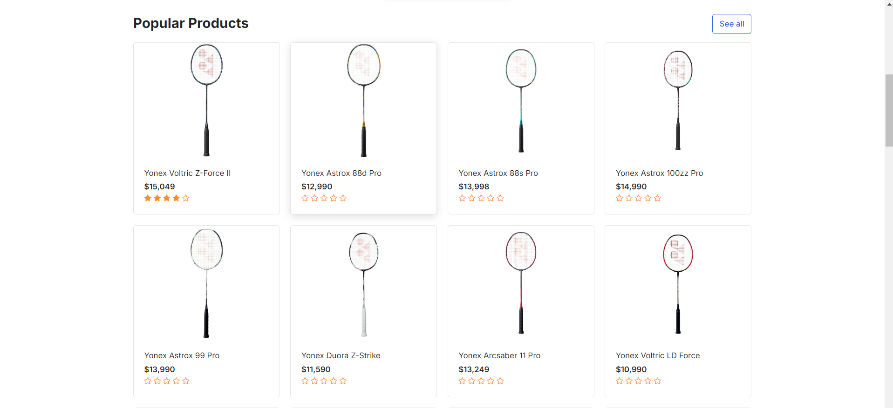
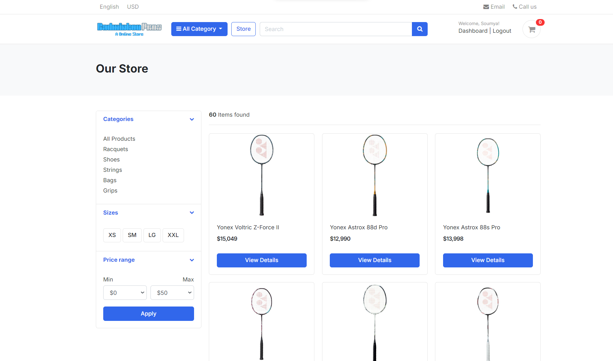
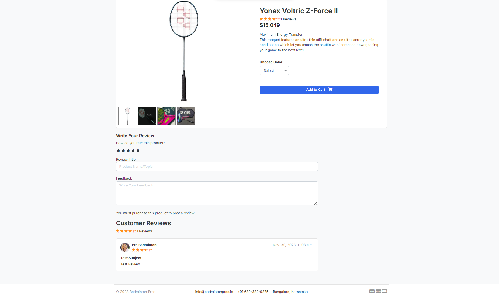
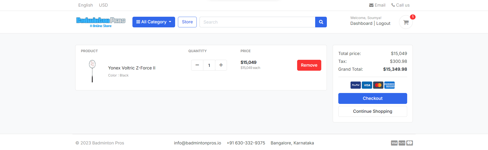
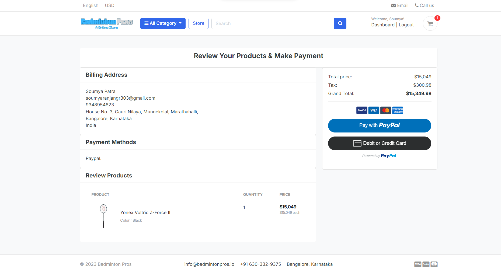

# Badminton Pros - Online Store

## Overview

Welcome to Badminton Pros, an online store dedicated to providing badminton enthusiasts with high-quality products. This web application is built using Django and Bootstrap, incorporating various features to enhance the user experience.

## Table of Contents

1. [Authentication](#authentication)
2. [Shopping Cart](#shopping-cart)
3. [Payment Integration](#payment-integration)
4. [Billing and Invoices](#billing-and-invoices)
5. [User Dashboard](#user-dashboard)
6. [Admin Security](#admin-security)
7. [Product Reviews and Comments](#product-reviews-and-comments)
8. [Profile Management](#profile-management)
9. [Product Search](#product-search)
10. [Automatic Logout](#automatic-logout)

## 1. Authentication

Users can register and log in to the website for a personalized shopping experience. The authentication process utilizes EMAIL Token Authentication, ensuring secure access. Users can verify their identity through tokens sent to their registered email address.

## 2. Shopping Cart

A seamless shopping experience is provided with the ability to add products to the cart. Users can choose product variations such as color and size before proceeding to checkout.

## 3. Payment Integration

To facilitate secure transactions, Badminton Pros integrates PayPal as the payment gateway, allowing users to make payments with confidence.

## 4. Billing and Invoices

User billing information is collected during the checkout process. After a successful payment, an invoice detailing the purchased products is generated and made available to the user.

## 5. User Dashboard

A user dashboard is created to keep track of all the products a user has ordered. This provides a convenient overview of their purchase history.

## 6. Admin Security

The admin panel is secured with authentication measures to prevent unauthorized access and potential security breaches, ensuring the website's integrity.

## 7. Product Reviews and Comments

Users can share their experiences and thoughts by adding reviews and comments to product listings. This fosters a community-driven approach and helps other users make informed decisions.

## 8. Profile Management

Users have the ability to edit their profiles, recover forgotten passwords, and change their passwords for enhanced account management.

## 9. Product Search

Efficient product search functionality is implemented to allow users to quickly find the items they are looking for.

## 10. Automatic Logout

To enhance security, users are automatically logged out after one hour of inactivity on the website.

# Project Setup

To get started with Badminton Pros and experience the world of online badminton shopping, follow these simple steps:

## Clone the GitHub Repository

```bash
git clone https://github.com/study-soumya/Badminton-Pros.git
```

## Create Virtual Environment

```bash
python -m venv env
```

## Activate the Virtual Environment

### For Windows

```bash
.\env\Scripts\activate
```

### For Linux/Mac

```bash
source env/bin/activate
```

## Install Packages

```bash
pip install -r requirements.txt
```

## Start the Server

```bash
py manage.py runserver
```

Now, open your web browser and navigate to `http://127.0.0.1:8000/` to access the Badminton Pros website.

## Register Yourself

1. Register on the website using a valid Gmail account.
2. Check your registered email for the verification token.

## Verify Token and Start Using the Website

Once you receive the verification token:

1. Enter the token on the website to complete the registration process.
2. Start exploring and shopping for your favorite badminton products!

Feel free to provide feedback, report issues, or contribute to the project. Happy badminton shopping at Badminton Pros!

# Contributors

- SOUMYA RANJAN PATRA

# License

This project is licensed under the MIT License.

# Acknowledgments

- Thanks to the Django and Bootstrap communities for their excellent frameworks.
- Special thanks to [Any additional acknowledgments or credits].

Feel free to contribute, report issues, or suggest improvements! Happy shopping at Badminton Pros!


# Website Images


